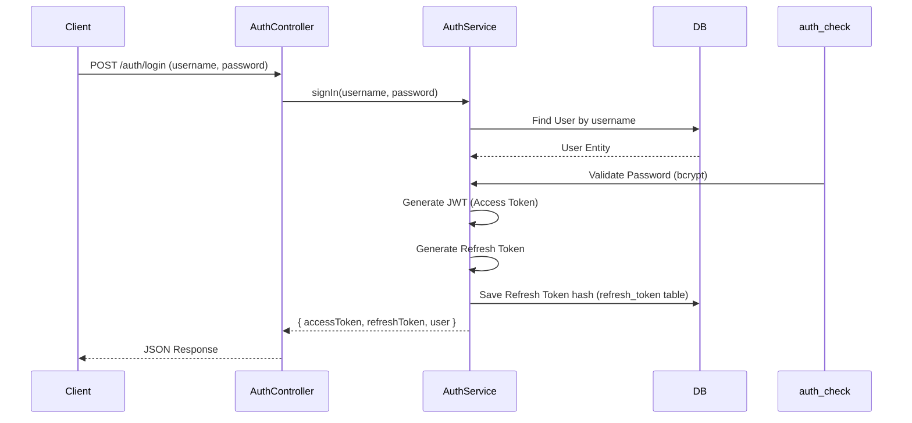

# Authentication Module

The `AuthModule` handles user identification and session management.

## Authentication Flow

### Sign In (Login)

The Sign-In process authenticates a user and issues a pair of tokens (Access + Refresh).

## Data Model (RefreshToken)

| Field        | Type     | Description            |
| :----------- | :------- | :--------------------- |
| `id`         | number   | Primary Key.           |
| `user_id`    | string   | User UUID (Reference). |
| `token`      | string   | Hashed token value.    |
| `expires_at` | datetime | Expiration date.       |
| `is_revoked` | boolean  | Revocation status.     |

## API Operations

| Endpoint                      | Method | Operation               | Auth Required | permissions |
| :---------------------------- | :----- | :---------------------- | :------------ | :---------- |
| `/api/v1/auth/login`          | POST   | Sign In                 | No (Public)   | None        |
| `/api/v1/auth/refresh`        | POST   | Refresh Access Token    | No (Public)   | None        |
| `/api/v1/auth/logout`         | POST   | Sign Out (Revoke Token) | Yes (JWT)     | None        |
| `/api/v1/auth/profile`        | GET    | Get Current User        | Yes (JWT)     | None        |
| `/api/v1/auth/reset-password` | POST   | Reset Password          | Yes (JWT)     | None        |
| `/api/v1/auth/cleanup-tokens` | POST   | Prune Expired Tokens    | Yes (JWT)     | None        |
