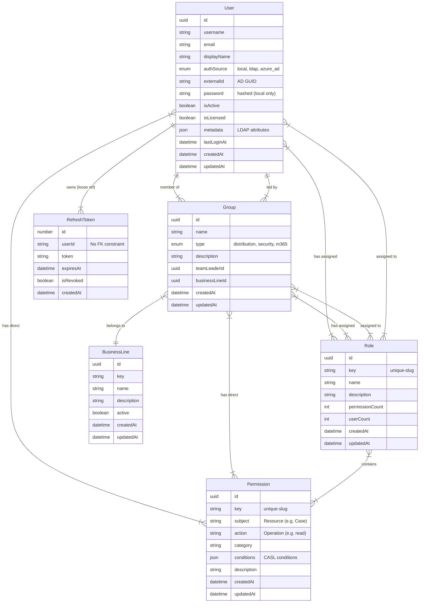

# Database Schema

This document outlines the data model for the ESM Server.

## Entity Relationship Diagram

## Data Dictionary

### Identity & Access

| Entity           | Description                                                                                            | Key Fields                            |
| :--------------- | :----------------------------------------------------------------------------------------------------- | :------------------------------------ |
| **User**         | Represents a system user. Can be sourced locally or synced from External Identity Providers (AD/LDAP). | `username`, `authSource`, `metadata` |
| **Role**         | A standard RBAC role that bundles permissions. Can be assigned to Users or Groups.                     | `key`, `name`                         |
| **Permission**   | A granular capability definition consisting of an Action and a Subject.                                | `action`, `subject`, `conditions`     |
| **RefreshToken** | Long-lived tokens used to refresh JWT access tokens.                                                   | `token`, `expiresAt`                 |

### Organization

| Entity           | Description                                                                   | Key Fields     |
| :--------------- | :---------------------------------------------------------------------------- | :------------- |
| **Group**        | Represents a Team or Department. Used for hierarchical permission assignment. | `name`, `type` |
| **BusinessLine** | High-level organizational division (e.g., IT, HR, Finance).                   | `key`, `name`  |

